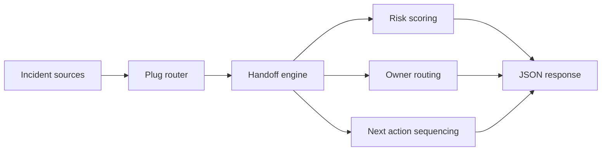

# Incident Handoff Broker

Incident Handoff Broker is an Elixir service for turning incident pressure into an ownership-aware response order. It ingests handoff context from operations, growth, security, and AI lanes, scores the transfer risk, and returns the next action before accountability drifts.

## Portfolio Takeaway

This project shows Elixir in a backend shape that actually fits the language: event intake, supervision, handoff routing, and time-sensitive coordination. Instead of another CRUD API, it models escalation pressure, owner gaps, and cross-functional transfer logic.

## Overview

| Area | Details |
| --- | --- |
| Language | Elixir 1.19.5 |
| Runtime | Erlang/OTP 28 |
| API Shape | Plug + Cowboy JSON API |
| Focus | Incident intake, owner routing, SLA pressure, escalation sequencing |
| Routes | `/`, `/docs`, `/api/dashboard/summary`, `/api/incidents/:id`, `/api/sample`, `/api/analyze/handoff` |
| Validation | `mix test` |

## What It Does

- models incident handoff threads between source and target teams
- scores severity, SLA drift, blocker count, bridge-state gaps, and confidence
- returns `stable`, `watch`, or `escalate` plus a next action and escalation lane
- exposes a lightweight API surface for dashboards, queues, or internal tooling

## Architecture



Additional detail lives in [docs/architecture.md](./docs/architecture.md).

## API

### `GET /`
Returns service metadata and route discovery.

### `GET /docs`
Serves a lightweight operator-facing documentation page.

### `GET /api/dashboard/summary`
Returns the live posture of the handoff queue.

### `GET /api/incidents/:id`
Returns a single incident thread with timeline, blockers, and next steps.

### `GET /api/sample`
Returns a sample scored handoff analysis.

### `POST /api/analyze/handoff`
Scores a handoff payload and returns the recommended response lane.

Example payload:

```json
{
  "id": "inc-4102",
  "source_team": "Platform Reliability",
  "target_team": "Revenue Systems",
  "severity": "critical",
  "sla_hours": 2,
  "elapsed_hours": 3.4,
  "bridge_state": "war-room-active",
  "confidence": 0.78,
  "blockers": [
    "Payment retry path is rate limited by edge policy",
    "Promo service dependency was rolled back but cache invalidation is incomplete"
  ],
  "dependent_teams": ["Platform Reliability", "Revenue Systems", "Support"],
  "next_steps": [
    "Shift checkout traffic to hardened recovery lane",
    "Pin cache invalidation ownership to revenue systems lead"
  ]
}
```

## Screenshots

### Hero


### Handoff Lanes


### Escalation Thread


### Validation Proof


## Local Run

```powershell
cd incident-handoff-broker
$env:ERLANG_HOME = "<path-to-erlang>"
$env:Path = "$env:ERLANG_HOME\\bin;<path-to-elixir>;$env:Path"
mix deps.get
mix run --no-halt
```

Then open:

- `http://127.0.0.1:4051/`
- `http://127.0.0.1:4051/docs`

## Validation

```powershell
cd incident-handoff-broker
$env:ERLANG_HOME = "<path-to-erlang>"
$env:Path = "$env:ERLANG_HOME\\bin;<path-to-elixir>;$env:Path"
mix test
```

## Portfolio Links

- [Kinetic Gain](https://kineticgain.com/)
- [Skills Page](https://mizcausevic.com/skills/)
- [LinkedIn](https://www.linkedin.com/in/mirzacausevic)
- [GitHub](https://github.com/mizcausevic-dev)
