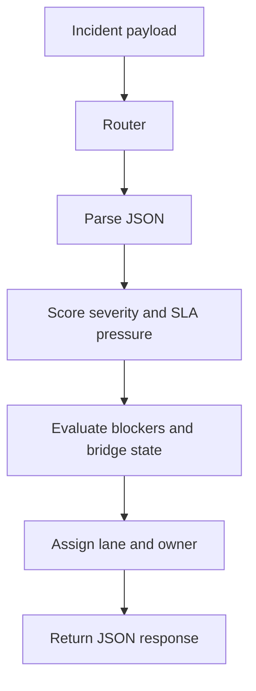

# Architecture

Incident Handoff Broker is intentionally lightweight:

- `Plug.Router` handles request intake and response shaping
- `HandoffEngine` turns raw incident context into a scored decision
- `SampleData` gives the service realistic scenarios for demo and proof
- `Plug.Cowboy` keeps the runtime operational without a full Phoenix stack

## Flow

## Decision Inputs

- severity
- SLA window versus elapsed time
- blocker count
- bridge-state quality
- confidence level
- dependent teams

## Decision Outputs

- `stable`, `watch`, or `escalate`
- risk score
- owner lane
- next action
- rationale object for downstream UIs
